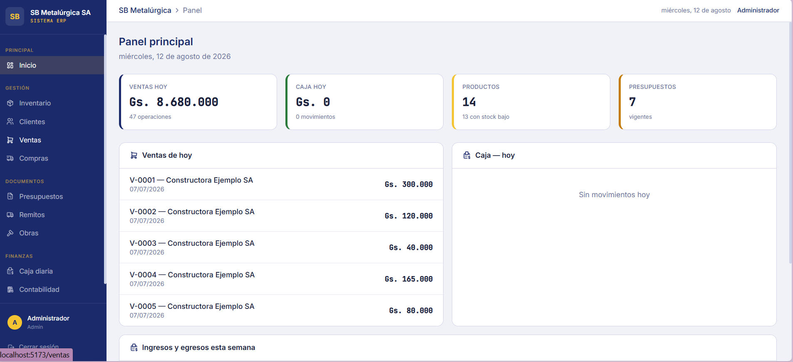
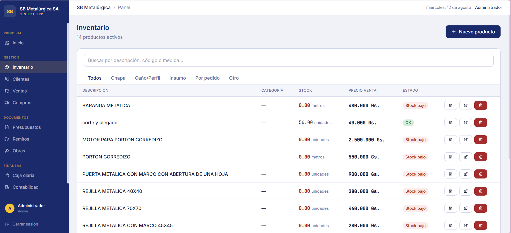
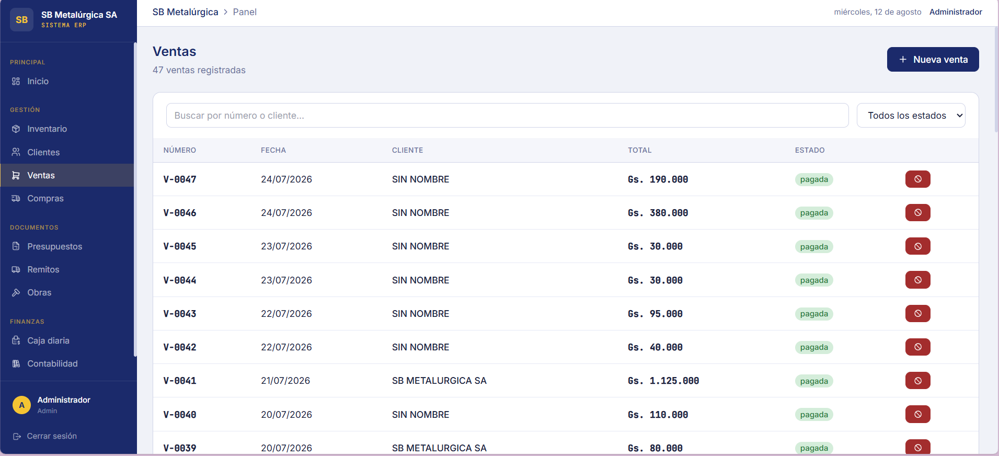
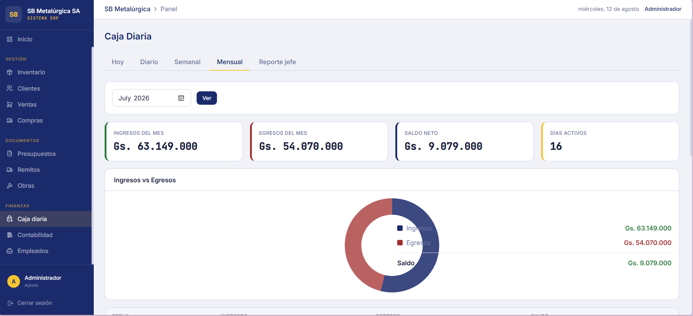

# SB Metalúrgica — ERP interno

Sistema de gestión (ERP) full-stack desarrollado para digitalizar la operación administrativa, contable y de inventario de una PyME metalúrgica: reemplaza planillas de Excel y procesos en papel por un sistema centralizado, con control financiero por áreas y trazabilidad de cambios.

> Proyecto real desarrollado para una empresa. Este repositorio es una versión saneada para portafolio: no incluye datos operativos, bases de datos, backups ni credenciales reales. Los valores sensibles se configuran mediante variables de entorno.

## Capturas del sistema

### Panel principal



### Inventario



### Ventas



### Gestión de caja


## Módulos

| Área | Funcionalidad |
|---|---|
| **Inventario** | Productos, stock, relación producto-proveedor para reposición automática |
| **Ventas** | Registro de ventas, ítems, estados de cobro |
| **Presupuestos** | Presupuestos por cliente, ítems, seguimiento de aprobación |
| **Remitos** | Notas de remisión con ítems y destinatario |
| **Compras** | Órdenes de compra, sugerencias de reposición por proveedor |
| **Proveedores** | Cuenta corriente por proveedor, historial de pagos, exportable a Excel/PDF |
| **Obras** | Seguimiento de obras/proyectos en curso |
| **Contabilidad** | Plan de cuentas, libro diario, asientos automáticos y manuales, balance de sumas y saldos, estado de resultados — con exportación a Excel/PDF |
| **Caja Chica** | Caja diaria: ventas y gastos operativos del día a día |
| **Caja Grande** | Caja separada para pagos de personal (adelantos, sueldos, aguinaldos, bonos), con cierre diario |
| **Empleados** | Legajo, historial de pagos editable/eliminable con reversión automática del asiento contable asociado |
| **Auditoría** | Registro de quién hizo qué cambio y cuándo, en las operaciones sensibles (plata, contabilidad, usuarios) |
| **Backups** | Backup automático diario (cron) de toda la base de datos, con rotación y descarga manual |
| **Power BI** | Modelo estrella de solo lectura para ventas, caja e inventario, sin datos personales ni credenciales |
| **Usuarios y roles** | Autenticación JWT, roles (admin / vendedor / caja / depósito), pantallas restringidas por rol |

## Stack técnico

**Frontend:** React 18, Redux Toolkit, React Router, Tailwind CSS, Chart.js, Tabler Icons, Vite
**Backend:** Node.js, Express, PostgreSQL (driver `pg`), JWT, `bcryptjs`
**Exportación de reportes:** ExcelJS, PDFKit
**Infraestructura:** Render (Web Service + PostgreSQL administrado), backups programados con `node-cron`

La guía de conexión, relaciones, medidas DAX y tema visual para Power BI está en [`docs/POWER_BI.md`](docs/POWER_BI.md).

## Arquitectura

```
sb-metalurgica/
├── backend/                 API REST (Node.js + Express + PostgreSQL)
│   └── src/
│       ├── controllers/     Lógica de negocio por módulo
│       ├── routes/          Definición de endpoints y permisos por rol
│       ├── middleware/      Autenticación JWT y control de acceso por rol
│       ├── db/              Esquema SQL, conexión, migraciones
│       └── utils/           Auditoría, backups, generación de asientos contables, exportes
├── frontend/                SPA en React
│   └── src/
│       ├── pages/           Una carpeta por módulo (ventas, contabilidad, empleados, etc.)
│       ├── components/      Componentes de UI reutilizables
│       ├── app/slices/      Estado global (Redux Toolkit — un slice por módulo)
│       └── services/        Cliente HTTP (Axios) y llamadas a la API
└── docs/                    Notas de desarrollo
```

## Decisiones de diseño que quiero destacar

- **Caja Chica vs. Caja Grande separadas a propósito**: las ventas del día a día y los pagos de personal usan tablas y flujos distintos, para que nunca se mezclen en el cierre de caja.
- **Auditoría explícita, no por trigger de base de datos**: se registra desde el controller (no con un trigger SQL) porque necesitamos saber *qué usuario de la aplicación* hizo el cambio — algo que un trigger a nivel de base de datos no puede saber por sí solo.
- **Edición de pagos con reversión contable**: si se corrige un pago ya cargado, el sistema anula el asiento contable original y genera uno nuevo (en vez de sobreescribirlo), para mantener trazabilidad en el libro diario. Además, bloquea la edición si el día de caja ya fue cerrado.
- **Backup sin dependencias del sistema operativo**: en vez de invocar `pg_dump` (que no siempre está disponible en el entorno de despliegue), el backup se genera en JS puro, exportando cada tabla a JSON con rotación automática de archivos viejos.

## Cómo correrlo localmente

Requiere Node.js 22 y PostgreSQL.

### Backend
```bash
cd backend
npm install
cp .env.example .env       # completar DATABASE_URL, JWT_SECRET, etc.
npm run migrate            # crea las tablas y el usuario admin inicial
npm run dev                # http://localhost:3000
```

### Frontend
```bash
cd frontend
npm install
cp .env.example .env       # por defecto ya apunta a localhost:3000
npm run dev                # http://localhost:5173
```

## Seguridad de la versión pública

- Los archivos `.env` y los backups están excluidos por Git.
- `.env.example` contiene únicamente valores ficticios.
- El inicio de sesión tiene límite de intentos y las rutas privadas requieren JWT y permisos por rol.
- Las cabeceras HTTP se refuerzan con Helmet y el servidor no expone su tecnología.
- Nunca cargues en este repositorio una base de datos, un backup o credenciales de la instalación real.
- En producción, los backups deben guardarse en almacenamiento persistente externo; el disco temporal del servicio no sustituye una política de recuperación.

## Sobre el desarrollo

Diseñé la arquitectura, el modelo de datos y las decisiones funcionales del sistema: relevamiento de necesidades, definición de módulos, reglas de negocio, implementación, pruebas y mejora continua. Utilicé herramientas de IA como apoyo durante la programación, manteniendo bajo mi responsabilidad el análisis, las decisiones, la validación y la implementación del proyecto.

## Uso del código

Código publicado exclusivamente con fines de evaluación profesional y portafolio. Todos los derechos reservados; consultá el archivo `LICENSE`.

## Integridad financiera y pruebas

- PostgreSQL guarda importes como `NUMERIC(14,2)`. Los cálculos nuevos de ventas, caja y balanceo de asientos usan enteros escalados (`BigInt`) y strings decimales, evitando sumar dinero con coma flotante.
- Los cierres y movimientos de Caja Grande usan transacciones `SERIALIZABLE`, bloqueos y auditoría dentro del mismo `COMMIT`.
- Caja Grande separa la capa HTTP (`controllers`) de sus casos de uso transaccionales (`services`) sin agregar capas innecesarias al resto de los módulos.

Ejecutá las pruebas unitarias con:

```bash
cd backend
npm test
```

Cubren aritmética decimal, rechazo de asientos desbalanceados y auditoría transaccional. Para producción todavía corresponden pruebas de integración contra PostgreSQL para login, permisos, ventas, cierres y reversiones.

## Backups: alcance y límites de producción

El job incorporado crea un snapshot consistente (`REPEATABLE READ`), escribe primero un archivo temporal, publica el resultado mediante renombrado atómico, evita ejecuciones solapadas y reporta SHA-256. La carpeta, frecuencia, activación y retención son configurables mediante variables de entorno.

El JSON local es una ayuda operativa, no una estrategia completa de recuperación: excluye auditoría, roles/objetos fuera de las tablas, WAL y recuperación a un punto en el tiempo. En producción se debe usar `pg_dump` o el mecanismo administrado del proveedor, almacenamiento externo cifrado e inmutable, alertas y restauraciones ensayadas. Con varias instancias, el cron debe ejecutarse como un worker único o job externo, no dentro de cada servidor web.
